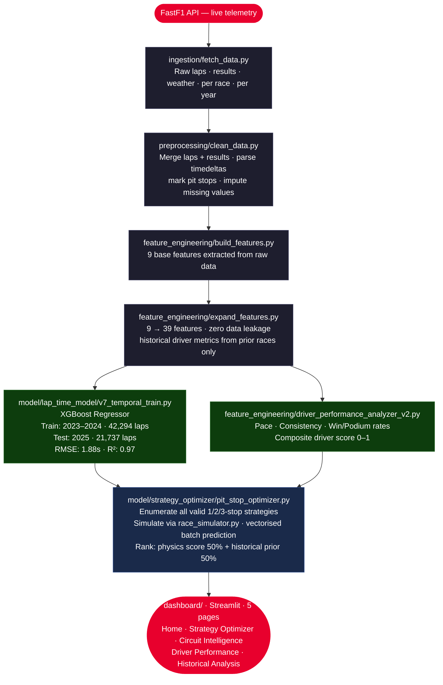
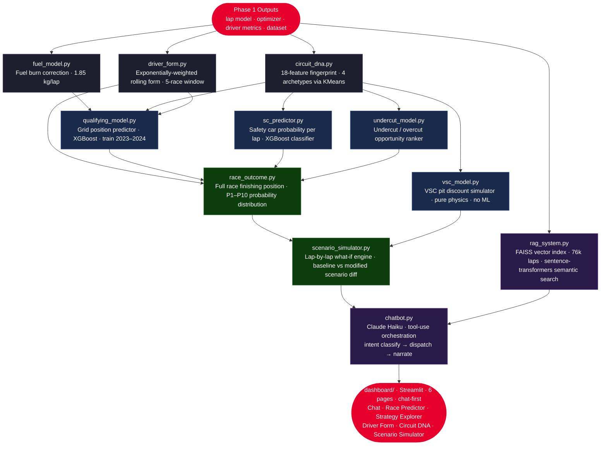

# F1 Analytics Engine 🏎️

An end-to-end AI-powered Formula 1 race strategy and outcome prediction system. Built as a university project, the system ingests real-world F1 telemetry via the FastF1 API, engineers a rich feature set across 76,163 laps from the 2023–2025 seasons, and trains machine learning models to predict lap times, optimise pit stop strategies, analyse driver performance, and (in Phase 2) predict full race outcomes with a conversational AI chatbot interface.

---

## Table of Contents

- [Project Overview](#project-overview)
- [Architecture](#architecture)
- [Module Status](#module-status)
- [Phase 1 — Completed Modules](#phase-1--completed-modules)
- [Phase 2 — Planned Modules](#phase-2--planned-modules)
- [Model Performance](#model-performance)
- [Project Structure](#project-structure)
- [Setup & Installation](#setup--installation)
- [Running the Project](#running-the-project)

---

## Project Overview

**Dataset:** 76,163 laps · 2023, 2024, 2025 seasons · 24 circuits · ~32 drivers · 39 features per lap

**Tech stack:** Python · Pandas · NumPy · XGBoost · Scikit-learn · FastF1 · Streamlit · Plotly · Anthropic API (Phase 2)

**Core idea:** Rather than treating a race as a single prediction problem, the system breaks race strategy down into its physical components — fuel load, tyre degradation, safety car probability, qualifying pace, undercut windows — and models each independently before combining them into a final race outcome prediction. A scenario simulator and LLM chatbot layer then let users explore "what if" questions in natural language.

---

## Architecture

### Phase 1 — Data & Modelling Pipeline



### Phase 2 — Intelligence Layer (Planned)



---

## Module Status

### Phase 1

| Module | Description | Status |
|--------|-------------|--------|
| Data ingestion | FastF1 API → raw CSVs per race/year | ✅ Complete |
| Data cleaning | Merge, cast, impute, mark pit stops | ✅ Complete |
| Feature engineering | 9 → 39 features, zero leakage | ✅ Complete |
| Lap time model v7 | XGBoost regressor, temporal split | ✅ Complete |
| Driver performance analyzer | Pace, consistency, win/podium scores | ✅ Complete |
| Pit stop strategy optimizer | Enumerate + simulate + rank strategies | ✅ Complete |
| Race simulator | Vectorised batch lap prediction | ✅ Complete |
| Historical strategy extractor | Builds per-circuit strategy priors | ✅ Complete |
| Streamlit dashboard | 5-page app (Home, Strategy, Circuit, Driver, History) | ✅ Complete |

### Phase 2

| Module | Description | Status |
|--------|-------------|--------|
| `fuel_model.py` | Fuel load estimation + lap time correction | 🔲 Not started |
| `circuit_dna.py` | 18-feature circuit fingerprint + clustering | 🔲 Not started |
| `driver_form.py` | Exponentially-weighted rolling form model | 🔲 Not started |
| `qualifying_model.py` | Grid position predictor (XGBoost) | 🔲 Not started |
| `sc_predictor.py` | Safety car probability per lap (XGBoost classifier) | 🔲 Not started |
| `vsc_model.py` | VSC pit discount + restart penalty simulator | 🔲 Not started |
| `undercut_model.py` | Undercut / overcut opportunity ranker | 🔲 Not started |
| `race_outcome.py` | Full race finishing position predictor | 🔲 Not started |
| `scenario_simulator.py` | Lap-by-lap what-if simulation engine | 🔲 Not started |
| `rag_system.py` | FAISS vector index over lap records | 🔲 Not started |
| `chatbot.py` | LLM orchestration via Anthropic API (Claude) | 🔲 Not started |
| Redesigned dashboard | Chat-first, 6-page Streamlit app | 🔲 Not started |

---

## Phase 1 — Completed Modules

### Lap Time Model (XGBoost v7)
- **Target:** `lap_time_seconds`
- **Training:** 2023–2024 data (42,294 laps); tested on 2025 (21,737 laps) — strict temporal split, no leakage
- **Top features:** `circuit_baseline_pace`, `tire_age_laps`, `compound_base_deg_rate`, `fuel_load_estimate`, `dirty_air_flag`
- **Output:** `model/lap_time_model/lap_time_model_v7.pkl`

### Driver Performance Analyzer
Computes a normalised composite score (0–1) per driver from clean racing laps (no pit laps, no formation laps, tire age ≥ 3):
- **Pace score** (40%) — mean lap time delta vs field expectation
- **Consistency score** (25%) — inverse of within-stint lap time std dev
- **Podium rate** (20%) — % of races finishing top 3
- **Win rate** (15%) — % of races finished 1st
- **Output:** `data/processed/driver_performance_metrics_v2.csv`

### Pit Stop Strategy Optimizer
- Enumerates all valid 1/2/3-stop strategies respecting F1 2025 regulations and empirical stint bounds (SOFT: 9–27 laps, MEDIUM: 13–35, HARD: 19–47)
- Simulates lap times for every strategy via batch XGBoost prediction
- Ranks strategies using a two-stage score: **physics rank** (predicted total race time) + **historical prior** (stop frequency, pit window alignment, compound sequence)
- Per-circuit profiles for 24 circuits stored in `circuit_strategy_profiles.json`

---

## Phase 2 — Planned Modules

### `fuel_model.py`
Every lap a car burns ~1.85 kg of fuel, making it ~0.035s/kg faster. This module estimates true fuel load per lap (accounting for safety car laps at 0.9× burn rate) and fits a per-circuit fuel sensitivity coefficient via linear regression. All Phase 2 modules use fuel-corrected lap times rather than raw times.

### `circuit_dna.py`
Encodes each circuit as an 18-feature numerical fingerprint across 6 categories — speed profile, tyre stress, overtaking, aero sensitivity, pit stop profile, and weather sensitivity. Circuits are then clustered into 4 archetypes (power circuit, street circuit, balanced, high-energy) via KMeans.

### `driver_form.py`
Extends the Phase 1 driver analyzer to weight recent races more heavily using exponential decay (`weight = 0.75^i` where i=0 is most recent). Outputs a rolling form score, consistency trend, and form slope (positive = improving) over a configurable window.

### `qualifying_model.py`
Predicts grid position before a race weekend using driver pace history at the circuit, recent form scores, team quali performance, and circuit DNA features. Trained on 2023–2024, tested on 2025. Grid position is the strongest single predictor of race outcome.

### `sc_predictor.py`
XGBoost classifier that estimates P(safety car) at each lap of a race. Since no SC flag exists in the dataset, SC laps are inferred via lap time spike detection (field-wide slowdown > 28% vs rolling 5-lap median). Handles class imbalance with `scale_pos_weight`. Outputs a full probability curve per race.

### `vsc_model.py`
Pure simulation (no ML). Quantifies the strategic opportunity a VSC creates — pit cost discount (~5–8s vs green flag), position reshuffling, and tyre warm-up penalty per compound after restart (SOFT: peak 0.8s, MEDIUM: 0.5s, HARD: 0.35s).

### `undercut_model.py`
Simulates whether pitting now lets a driver emerge ahead of a specific rival. Computes pace gain per lap on fresh tyres vs current compound, estimates laps needed to offset pit loss, and ranks all driver pairs within 3s by opportunity strength.

### `race_outcome.py`
The capstone prediction model. Combines predicted grid position, driver form, circuit DNA, pit strategy rank, mean SC probability, and tyre stress score into a final position prediction. Also outputs a P1–P10 probability distribution per driver via empirical residual analysis.

### `scenario_simulator.py`
Lap-by-lap simulation loop. Runs a full race in both a baseline and a modified scenario (early pit stop, grid change, rain, safety car), then diffs the two to show position and time deltas per driver.

### `rag_system.py`
FAISS vector index over the 76k lap dataset, converted to natural language strings. Enables the chatbot to answer historical stat queries (e.g. "who had the fastest lap at Spa in 2024?") without ML inference, using semantic search via `sentence-transformers`.

### `chatbot.py`
LLM orchestration using the Anthropic API (`claude-haiku-4-5`). Classifies user intent, calls the right tool (predict race outcome, optimize strategy, run scenario, query history, etc.), and narrates the result in natural language. Maintains multi-turn conversation history.

---

## Model Performance

| Metric | Value |
|--------|-------|
| Algorithm | XGBoost Regressor |
| Train set | 2023 + 2024 — 42,294 laps |
| Test set | 2025 — 21,737 laps |
| RMSE | 1.88s |
| MAE | 1.46s |
| R² | 0.97 |
| Features used | 23 |

---

## Project Structure

```
AI assistant F1 Model/
├── main.py                          ← Full pipeline orchestrator
├── requirements.txt
├── NOTES.md                         ← Known issues & Phase 2 reminders
│
├── ingestion/
│   └── fetch_data.py                ← FastF1 API → raw CSVs
│
├── preprocessing/
│   └── clean_data.py                ← Merge, cast, impute
│
├── feature_engineering/
│   ├── build_features.py            ← 9 base features
│   ├── expand_features.py           ← 9 → 39 features (no leakage)
│   └── driver_performance_analyzer_v2.py
│
├── model/
│   ├── lap_time_model/
│   │   ├── v7_temporal_train.py     ← XGBoost training pipeline
│   │   ├── lap_time_model_v7.pkl    ← Production model
│   │   ├── circuit_baselines.json   ← Median lap times per circuit
│   │   ├── pit_loss_estimates.json  ← Pit stop time costs per circuit
│   │   └── model_metadata.json
│   │
│   └── strategy_optimizer/
│       ├── pit_stop_optimizer.py    ← Main optimizer
│       ├── race_simulator.py        ← Vectorised batch prediction
│       ├── regulations.py / .json   ← F1 2025 rules + circuit overrides
│       ├── circuit_strategy_profiles.json
│       ├── historical_strategy_extractor.py
│       └── validations/             ← Sanity checks & debugging scripts
│
├── data/
│   ├── f1_features_dataset.csv      ← Full dataset (string labels, 39 cols)
│   ├── processed/
│   │   ├── driver_performance_metrics_v2.csv
│   │   └── historical_strategies.csv
│   └── training_data/
│       ├── f1_training_dataset.csv  ← ML-ready (integer encoded, 38 cols)
│       ├── category_mappings.json   ← team / circuit / compound encodings
│       └── 2023/ 2024/ 2025/        ← Raw & cleaned CSVs per year
│
└── dashboard/
    ├── Home.py                      ← Entry point
    ├── pages/
    │   ├── 1_Strategy_Optimizer.py
    │   ├── 2_Circuit_Intelligence.py
    │   ├── 3_Driver_Performance.py
    │   └── 4_Historical_Analysis.py
    └── utils/
        ├── constants.py
        ├── data_loader.py
        └── charts.py
```

---

## Setup & Installation

### Prerequisites
- Python 3.9+
- macOS / Linux (Windows works but `PYTHONPATH=.` syntax differs)
- Git
- `brew` (macOS only, for OpenMP)

### Step 1 — Clone the repository

```bash
git clone https://github.com/Shrey-Ritesh/F1-Analytics-Engine.git
cd F1-Analytics-Engine
```

### Step 2 — Create a virtual environment

```bash
python3.9 -m venv venv
source venv/bin/activate      # macOS / Linux
# venv\Scripts\activate       # Windows
```

### Step 3 — Install dependencies

```bash
pip install -r requirements.txt
```

### Step 4 — macOS only: install OpenMP (required by XGBoost)

```bash
brew install libomp
```

### Step 5 — Verify the setup

```bash
PYTHONPATH=. python -c "import xgboost, fastf1, streamlit; print('All good')"
```

---

## Running the Project

> All commands must be run from the repo root (`F1-Analytics-Engine/`) with `PYTHONPATH=.` set.

### Launch the Dashboard (recommended starting point)

```bash
PYTHONPATH=. streamlit run dashboard/Home.py
```

Open **http://localhost:8501** in your browser.

---

### Run the Strategy Optimizer (CLI)

Validates Bahrain, Monaco, and Qatar scenarios and prints ranked strategy tables.

```bash
PYTHONPATH=. python -m model.strategy_optimizer.pit_stop_optimizer
```

---

### Retrain the Lap Time Model

Trains XGBoost on 2023–2024, evaluates on 2025, saves `lap_time_model_v7.pkl`.

```bash
PYTHONPATH=. python model/lap_time_model/v7_temporal_train.py
```

---

### Rebuild Driver Performance Metrics

Recomputes all driver scores from the training dataset.

```bash
PYTHONPATH=. python feature_engineering/driver_performance_analyzer_v2.py
```

---

### Run the Full Data Pipeline

Fetches fresh data from the FastF1 API, cleans, engineers features, and writes all CSVs.
**Note: slow — makes live API calls and caches responses locally.**

```bash
PYTHONPATH=. python main.py
```

---

### Validation & Debugging

```bash
# Inspect pit stop data by circuit/year
PYTHONPATH=. python model/strategy_optimizer/validations/check_pit_data.py

# Check historical prior scores
PYTHONPATH=. python model/strategy_optimizer/validations/check_priors.py

# Analyse stint length distributions (basis for STINT_BOUNDS)
PYTHONPATH=. python model/strategy_optimizer/validations/check_stint_ranges.py

# Validate circuit profile data
PYTHONPATH=. python model/strategy_optimizer/validations/sanity_check.py

# Run extended test scenarios across multiple circuits
PYTHONPATH=. python model/strategy_optimizer/validations/extra_validations.py
```

See `model/strategy_optimizer/validations/README.md` for details on each script.

---

## Notes

See [`NOTES.md`](./NOTES.md) for known data quality issues, column name remappings, and implementation decisions kept in mind for Phase 2.
