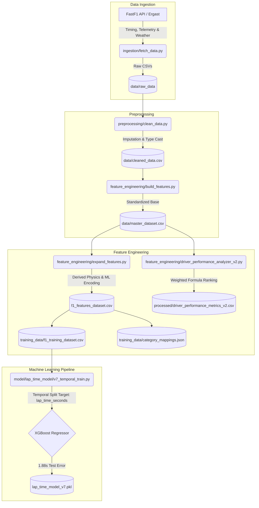

# F1 Analytics Engine 🏎️📊

An advanced, end-to-end Machine Learning data pipeline designed to parse live telemetry and historical Formula 1 race data, engineer deep strategic features, and serialize robust predictive models using Python, XGBoost, and the FastF1 API.

This system is built deliberately for algorithmic strategy simulation—moving beyond simple descriptive statistics to establish predictive capabilities like predicting variance (Lap Time Deltas) based purely on racing physics and tire degradation without succumbing to temporal track length bias.

---

## Architecture Flow



---

## Core Modules & Capabilities

### 1. Multi-Season Ingestion & Preprocessing
Extracts raw timing, laps, weather, and compound arrays seamlessly from FastF1 APIs spanning 2023, 2024, and 2025. Automates cleaning, structural joining, and imputation logic into a unified foundational `master_dataset.csv`.

### 2. Feature Engineering Logic (`expand_features.py`)
Expands the crude raw telemetry from 9 base columns to an intelligently synthesized **39-Feature DataFrame**, producing elements fundamentally critical to machine learning trees:
- **Compound Degradation Core**: Calculating specific tire stress interactions based on stint progression and dynamic compound constants.
- **Track Baselines**: Establishing strict, non-leaky empirical median capability bounds for isolated dry-stint physics.
- **Dirty Air & Cold Tire Flags**: Penalty checks measuring gap proximity and thermal tire warmup.
- **Dual Export Protocol**: Spits out a human-readable CSV while identically outputting a label-encoded integer matrix optimized specifically to avoid Python dtype errors in sklearn algorithms, backed by an index definition JSON.

### 3. Driver Performance Analyzer 
Independently ranks driver efficiency mathematically. Eliminates statistical spoofing (e.g. drivers inflating their stats via sampling only small, fast circuits) by normalizing to `lap_time_delta` against standard deviation consistency limits. 

### 4. Lap Time Prediction Engine (v7)
A highly optimized, multi-season `XGBRegressor` machine learning model.
- **Anti-Leakage Auditing**: Strips all target leakages (`expected_lap_time`, `final_race_position`) prior to fitting, forcing the tree to learn from natively unassisted physics.
- **Temporal Out-of-Sample Isolation**: Strictly trains exclusively on historic `2023` and `2024` telemetry, mathematically evaluated entirely on out-of-sample data simulating the `2025` season directly.
- **Model Metadata Guardrails**: Outputs a `.json` mapping algorithm flagging low-confidence tracks (e.g., Extreme Wet Silverstone/Circuit Gevilles) to inform Strategy Simulator bounds dynamically.
- **Performance**: Predicts out-of-sample empirical absolute lap times dynamically across 24 countries natively with an intrinsic **RMSE of 1.88 seconds.**

---

## Project Setup

### Requirements
- Python 3.9+
- `pip install -r requirements.txt` (which installs pandas, numpy, scikit-learn, xgboost, fastf1, requests)
- For XGBoost on Mac OS: You might need to install OpenMP via Homebrew (`brew install libomp`)

### Automation
To spin up and run the entire unified end-to-end pipeline from fetching data through processing:
```bash
source venv/bin/activate
python main.py
```
*(Configure the target season/year dynamically internally).*

To retrain the master XGBoost prediction model:
```bash
python model/lap_time_model/v7_temporal_train.py
```

---
*Created as the central computational backend for an AI-Based Formula 1 Race Strategy & Outcome Prediction System.*
